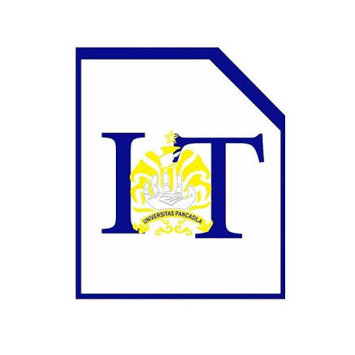
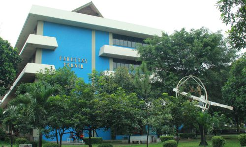

# Organisasi Mahasiswa Kampus

## Tentang Organisasi

Organisasi Mahasiswa Kampus merupakan wadah bagi mahasiswa untuk mengembangkan kemampuan, pengalaman, kreativitas, dan kerja sama dalam lingkungan kampus.

Organisasi ini terbuka bagi mahasiswa yang ingin berpartisipasi dalam berbagai kegiatan akademik maupun non-akademik.

---

## Program dan Kegiatan

### Kegiatan Organisasi

* Pengabdian Masyarakat (Pengmas)
* Kelas Organisasi (Kelor)
* Buka Bersama (Setiap Bulan Puasa)
* Tekno
* Positif

### Jenis Kegiatan

**Pengmas**
Kegiatan dilakukan untuk menambah Relasi, dan Pengalaman Bagi Mahasiswa.

**Kelas Organisasi**
Kegiatan dilakukan untuk melatih Mahasiswa dalam bidang keorganisasian.

**Tekno**
Kegiatan ini dibuat untuk mengembangkan skill yang mereka sesuai dengan tema yang sudah di tetapkan.

---

## Alur Pendaftaran

Mahasiswa yang ingin bergabung dapat mengikuti beberapa tahapan pendaftaran berikut:

1. Mengisi formulir pendaftaran.
2. Mengikuti proses seleksi.
3. Mengikuti wawancara.
4. Menunggu pengumuman hasil seleksi.
5. Mengikuti kegiatan pengenalan anggota.

---

## Kontak dan Informasi

Untuk mendapatkan informasi lebih lanjut, silakan mengunjungi website kampus:

[Website Eksternal FTUP](https://univpancasila.ac.id/fakultas-teknik/)

Website Linktree:
[@imatika_ftkmup](https://linktr.ee/imatika_ftkmup?utm_source=ig&utm_medium=social&utm_content=link_in_bio&fbclid=PAcGRvZgJleHRuA2FlbQIxMQBzcnRjBmFwcF9pZA85MzY2MTk3NDMzOTI0NTkAAafJK_jx22EozsTUqNDlguzAydEjUza_NOAYdSULafBhN_aWCmHgH7qlw9toFw_aem_H5YBK_vuzRmLq8xYIfEGBA)

Instagram:
[@imatika_ftkmup](https://www.instagram.com/imatika_ftkmup/)

---

&copy; 2026 @imatika_ftkmup